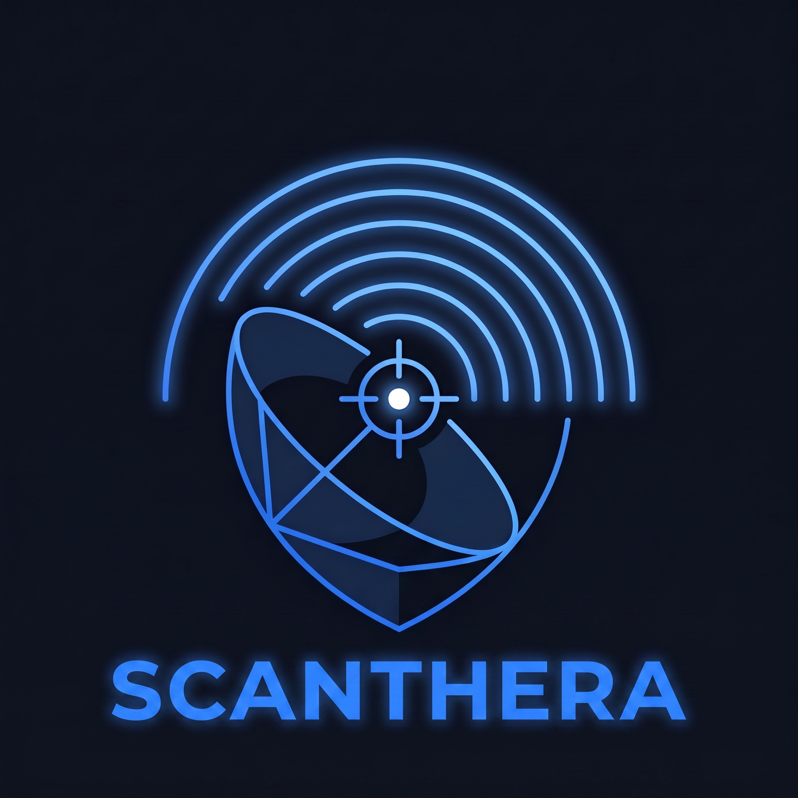
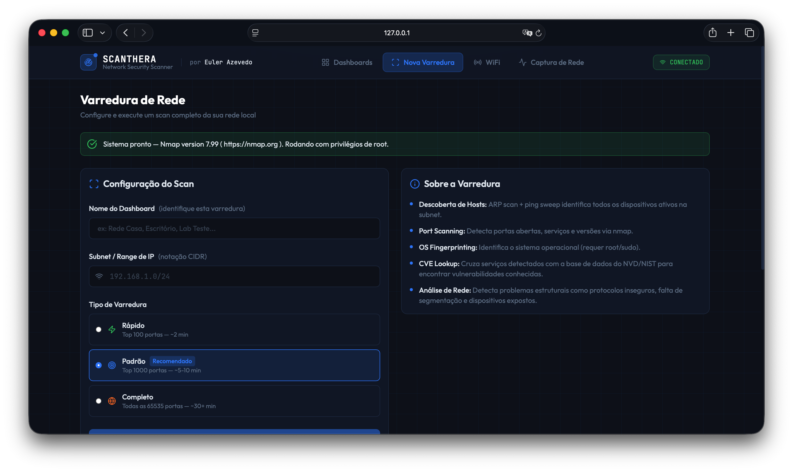

<p align="center">
  
</p>

# SCANTHERA — Network Security Scanner

> Plataforma de segurança de rede com dashboard web moderno, captura de pacotes em tempo real, scanner WiFi, análise de vulnerabilidades e exportação de relatórios.

Criado por **[Euler Azevedo](https://github.com/eulerazevedo)** · versão **1.1**



---

## Visão Geral

O SCANTHERA é uma ferramenta completa de auditoria de redes locais. Descobre dispositivos, escaneia portas, identifica sistemas operacionais, cruza serviços com vulnerabilidades conhecidas (CVEs via NVD/NIST), analisa redes WiFi, captura e inspeciona tráfego de rede em tempo real — tudo em uma interface web escura e moderna.

### Frameworks de segurança cobertos

| Framework | Cobertura |
|---|---|
| **NIST SP 800-115** | Technical Guide to Network Security Testing |
| **NIST CSF** | Cybersecurity Framework — Identify & Protect |
| **CIS Controls v8** | Controls 1, 2, 4, 7, 12 |
| **OWASP** | Network Security Testing Guide |
| **ISO 27001** | A.12.6 — Vulnerability Management |
| **CVE / NVD** | NIST National Vulnerability Database |

---

## Funcionalidades

### Descoberta de Rede
- ARP scan + ping sweep para detectar todos os dispositivos ativos
- Identificação de IP, MAC address, hostname e fabricante
- Classificação automática do tipo de dispositivo (router, server, workstation, IoT, câmera, etc.)

### Port Scanning

| Modo | Portas | Tempo estimado |
|---|---|---|
| Rápido | Top 100 | ~2 min |
| Padrão | Top 1000 | ~5–10 min |
| Completo | Todas as 65535 | ~30+ min |

### OS Fingerprinting
- Detecta sistema operacional e versão (requer root/sudo)

### Vulnerabilidades (CVEs)
- Consulta automática à API do NVD (NIST) para cada serviço detectado
- Exibe CVE ID, descrição, CVSS score e severidade (critical / high / medium / low)

### Análise de Rede
- Detecção de protocolos inseguros: Telnet, FTP, HTTP administrativo
- Bancos de dados expostos na rede (MySQL, PostgreSQL, MongoDB, Redis)
- Serviços de acesso remoto expostos (RDP, VNC, SMB)

### Score de Risco
- Score de 0 a 100 com gauge visual
- Classificações: **SEGURO** / **ATENÇÃO** / **ALTO RISCO** / **CRÍTICO**

### Scanner WiFi
- Detecta todas as redes WiFi próximas com SSID, BSSID, canal, sinal e criptografia
- Avaliação automática do nível de segurança de cada rede (WPA3 / WPA2 / WEP / Aberta)
- Estimativa de tempo de quebra de senha por wordlist e força bruta

### Topologia de Rede
- Detecção de gateway, MAC do roteador e fabricante
- Identificação de firewall e técnicas de filtragem ativas
- Traceroute visual com hops e diagnóstico da infraestrutura

### Captura de Pacotes em Tempo Real
- Captura de tráfego ao vivo com streaming por WebSocket
- Filtros: Tudo, Sem Criptografia, HTTP, DNS, ARP, ICMP, TCP, UDP
- Detecção automática de conexões sem criptografia: HTTP, FTP, Telnet, SMTP e outros
- Inspeção de pacotes com payload, headers sensíveis e hex dump
- Exportação CSV do buffer capturado

### Relatórios
- Cada varredura gera um dashboard individual com nome customizável
- Exportação de relatório em `.html` e `.json`

---

## Download

Acesse a [página de releases](https://github.com/eulerazevedo/scanthera-releases/releases/latest) e baixe o executável para o seu sistema:

| Sistema | Arquivo |
|---|---|
| macOS | `scanthera-macos.zip` |
| Linux | `scanthera-linux.tar.gz` |
| Windows | `scanthera-windows.exe.zip` |

---

## Requisitos

O **nmap** precisa estar instalado no sistema:

```bash
# macOS
brew install nmap

# Ubuntu / Debian
sudo apt install nmap

# Fedora
sudo dnf install nmap
```

Windows: baixe em [nmap.org/download.html](https://nmap.org/download.html)

---

## Como usar

### macOS / Linux

```bash
# Extraia o arquivo e execute com privilégios de root
sudo ./scanthera
```

> **macOS — aviso de segurança:** Na primeira execução o macOS pode bloquear o app por não ter assinatura Apple. Para liberar, execute no terminal:
> ```bash
> sudo xattr -rd com.apple.quarantine ./scanthera-macos
> sudo ./scanthera-macos
> ```
> Ou clique com o botão direito no arquivo → segure **Option (⌥)** → clique **"Abrir"** → **"Abrir"**.

### Windows

Extraia o `.zip`, clique com o botão direito em `scanthera-windows.exe` → **Executar como administrador**.

> Privilégios de administrador/root são necessários para ARP scan, OS fingerprinting e captura de pacotes.

---

## Após executar

O dashboard abre automaticamente no navegador em `http://localhost:7777`.

---

## Aviso Legal

Esta ferramenta é destinada exclusivamente ao uso em redes das quais você tem autorização explícita para realizar testes de segurança. O uso em redes de terceiros sem autorização é ilegal e antiético. O autor não se responsabiliza pelo uso indevido desta ferramenta.

---

*SCANTHERA v1.1 — criado por [Euler Azevedo](https://github.com/eulerazevedo)*
